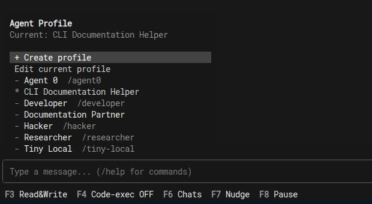
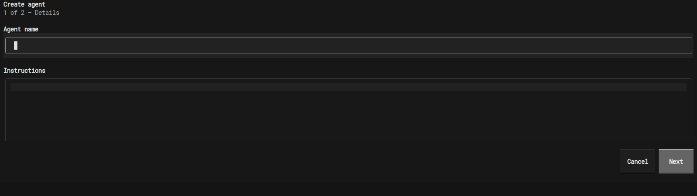
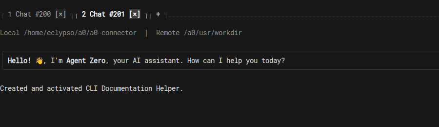
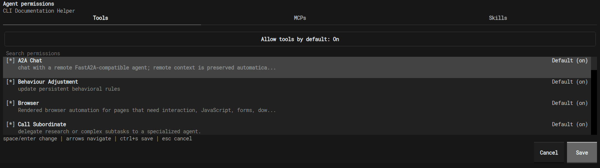

# a0-connector

Terminal connector for [Agent Zero](https://github.com/frdel/agent-zero). It pairs a Textual CLI with a small Agent Zero plugin so you can chat from the terminal, follow streaming events, and use the connector-specific remote editing/runtime features.

## Components

| Component | Location | Purpose |
|-----------|----------|---------|
| CLI (`a0`) | `src/agent_zero_cli/` | Textual UI, headless stdio mode, and session-aware transport client |
| Plugin (`_a0_connector`) | Agent Zero Core `plugins/_a0_connector` | Builtin plugin that exposes the connector HTTP + Socket.IO surface |

The CLI requires an Agent Zero build that includes the builtin `_a0_connector` plugin.

## Install

### 1. Install on macOS / Linux

```bash
curl -LsSf https://raw.githubusercontent.com/agent0ai/a0-connector/main/install.sh | sh
```

### 2. Install on Windows PowerShell

```powershell
irm https://raw.githubusercontent.com/agent0ai/a0-connector/main/install.ps1 | iex
```

### 3. Run

```bash
a0
```

Clipboard image paste works natively on macOS and Windows. Linux needs one
small system clipboard helper: install `wl-clipboard` on Wayland or `xclip` on
X11 (for Ubuntu, `sudo apt install wl-clipboard` or `sudo apt install xclip`).

### Inline terminal images

The interactive TUI renders eligible browser screenshots, user attachments,
and assistant images beneath their owning transcript entry. Browser screenshots
stay beneath the same Browser tool metadata that produced them; they do not add
a second transcript event. Images open in the expanded complete-aspect view,
up to 96 by 32 terminal cells. Select an image with click, `Enter`, or `Space`
to collapse it to a 36-by-12-cell thumbnail or expand it again.

Set `A0_CLI_IMAGE_MODE` to `auto` (default), `tgp`, `sixel`, `halfcell`, or
`off`. Keep `auto` for normal use: it combines terminal capability reporting,
live protocol probes, and compatibility guards to choose native TGP or Sixel.
Without a complete native protocol, it keeps the ordinary text transcript and
does not add or fetch images. This is based on terminal capability, so Bash,
Zsh, and PowerShell behave the same; the terminal hosting the shell decides.
`halfcell` is an explicit low-resolution preview/debug mode, while `off` always
keeps the pre-image transcript behavior. Apple Terminal and Warp therefore show
no images automatically. A direct iTerm session can advertise Sixel and use the
native raster renderer. Verify a capable terminal separately before treating
forced TGP or Sixel as accepted.

Computer-use backends are embedded in the `a0` wheel, so the CLI and local computer-use support install and update together. Linux host computer use uses the Wayland portal backend; X11/Xpra control belongs to Agent Zero's internal Docker Desktop tooling rather than the remote host connector.

## Manual install

If you already use `uv`, the installer and update flow resolve the latest
published GitHub release at runtime. They default to a managed CPython 3.12
tool environment across macOS, Linux, and Windows, and install with the
dependency locks committed to the same A0 release. `uv` can download the
managed Python automatically without requiring `git` to be installed:

```bash
curl -LsSf https://raw.githubusercontent.com/agent0ai/a0-connector/main/install.sh | sh
```

Set `A0_PYTHON_SPEC` if you need to override that interpreter request. If you
set `A0_PACKAGE_SPEC` for a custom package source, also set
`A0_RUNTIME_CONSTRAINTS` and `A0_BUILD_CONSTRAINTS`; use
`A0_ALLOW_UNPINNED_UPDATE=1` only for intentional development installs.
Advanced one-off runs with `uvx` also work, but they are intentionally not the
primary install path for this project.

## Update

If you installed `a0` with the standard `uv tool` flow, update it in place with:

```bash
a0 update
```

By default `a0 update` resolves the latest published GitHub release at runtime,
downloads that release's runtime and build constraints, and installs it into
the managed CPython 3.12 tool runtime used by the installer. The updater
upgrades A0 itself while keeping dependencies pinned to the tested release set.
For advanced cases you can override the interpreter request with
`A0_PYTHON_SPEC`, or provide `A0_PACKAGE_SPEC` together with
`A0_RUNTIME_CONSTRAINTS` and `A0_BUILD_CONSTRAINTS`.

`a0 update` requires `uv` to be available on your `PATH`.

## Agent Zero Core

No separate plugin install is required for users once Agent Zero Core ships `_a0_connector` as a builtin plugin.

This repo does not contain a vendored plugin copy. For Core development, edit the builtin plugin directly in your Agent Zero checkout/runtime copy and restart Agent Zero after changes:

- Local Agent Zero checkout: `<agent-zero>/plugins/_a0_connector`
- Docker-based Agent Zero runtime: `/a0/plugins/_a0_connector`

## Connect

```bash
a0
```

On every launch the CLI opens the host picker first. It checks Docker for local Agent Zero containers, lists any detected WebUI endpoints as friendly URLs such as `http://localhost:50001`, and lets you connect explicitly with Enter or the `Connect` button.

If Docker finds exactly one local Agent Zero endpoint and there is no conflicting saved manual host, the CLI auto-enters that instance:
- open instance: it connects immediately
- protected instance: it advances directly to the login stage

Manual URL entry is available from the same panel for remote hosts or anything Docker cannot see. `AGENT_ZERO_HOST` still seeds the picker/manual URL instead of forcing an immediate connection.

Protected instances use the same web login as Agent Zero itself. The CLI posts to `/login`, keeps the resulting session cookie in memory for the current process, and forwards that session to `/ws`. Open instances skip the login stage entirely.

If you want to prefill a host, export it before starting the CLI:

```bash
export AGENT_ZERO_HOST=http://localhost:50001
a0
```

Or pass it directly for a one-off launch:

```bash
a0 --host http://localhost:5080
```

Use `a0 --no-auto-connect` to keep the picker open even when Docker finds exactly one local instance. Use `a0 --no-docker-discovery` to skip Docker inspection and open manual URL entry immediately, which is useful for remote hosts, HTTPS tunnels such as Cloudflare, or machines without Docker.

You can optionally remember the chosen host from inside the app. Protected
sessions may persist browser-style session cookies for that host so future CLI
runs can reconnect; the CLI never stores usernames, passwords, or connector
tokens.

## Headless mode

Use `a0 headless` when you need the connector without the full-screen Textual
interface. It streams events over stdout and keeps remote file, remote exec,
and workspace-tree publishing active for the subscribed chat.

```bash
a0 headless --host http://localhost:32080
echo "what is 2+2" | a0 headless --host http://localhost:32080 --print --output jsonl
```

Headless host resolution uses `--host`, then saved/env config, then Docker
single-instance discovery. Protected instances reuse a persisted web session,
`A0_USERNAME`/`A0_PASSWORD`, or TTY prompts; non-TTY auth failures exit with
code `2`. Headless and `a0 gateway` remain text/JSONL-only: they neither import
terminal-image rendering nor emit terminal image-protocol bytes. See [Headless mode](https://github.com/agent0ai/a0-connector/blob/main/docs/headless.md).

## Usage

### Footer shortcuts

| Shortcut | Action |
|----------|--------|
| `F6` | List chats |
| `F7` | Nudge agent |
| `F8` | Pause / resume |
| `Ctrl+P` | Command palette |

### Slash commands

| Command | Action |
|---------|--------|
| `/help` | Show available commands |
| `/chats` | Switch chats |
| `/clear` | Clear the visible chat log |
| `/new` | Start a new chat |
| `/compact` | Compact the current chat when supported |
| `/goal <objective>` / `/goal update <text>` / `/goal delete` | Set, update, or delete the active chat goal; setting or reactivating a terminal goal sends the objective to the agent |
| `/nudge` | Nudge the current agent run |
| `/pause` / `/resume` | Pause or resume the active agent run |
| `/presets` | Pick a model preset |
| `/models` | Override runtime models for the current chat |
| `/profile` / `/profile <agent>` / `/profile "<name>" "<instructions>"` | Select, create, or edit the current agent profile |
| `/permissions` | Edit Tools, MCP, and Skill permissions for the current agent |
| `/computer-use on` / `/computer-use off` | Advertise or disable local Computer Use from this CLI; enabling arms the platform permission flow when needed |
| `/browser status` | Show host-browser connector status |
| `/browser host on` / `/browser host off` | Advertise or disable host-browser control from this CLI and sync Agent Zero Browser mode when supported |
| `/browser profile` | List detected Chromium-family profiles; pass `<family> <profile>` to select, for example `chrome-a0 Default` |
| `/browser list` | List host-browser targets |
| `/browser auto` / `/browser <number>` / `/browser <id>` / `/browser <host:port>` / `/browser ws://...` | Choose the current Agent Zero Browser host target |
| `/browser relaunch` | Prepare the host browser now, either by attaching to allowed Chrome remote debugging or by starting the selected local profile |
| `/browser repair` | Install missing Python Playwright for the local-profile launch path |
| `/browser privacy` | Show where host-browser content policy is configured |
| `/disconnect` | Disconnect and return to the current host connection flow |
| `/keys` | Toggle key help |
| `/quit` | Exit |

### Agent profiles and permissions

Run `/profile` to open the profile menu. It lists profiles available from Agent
Zero and gives you **Create profile** and **Edit current profile** actions.



The interactive editor asks for the profile name and instructions, then lets
you review tool access before saving.



You can also select or create directly from the composer:

```text
/profile Developer
/profile "Source Scout" "Verify every important claim and cite the source."
```

Use an unquoted name or profile ID when selecting an existing profile. Quick
creation opens a fresh chat with the new profile activated.



Run `/permissions` to edit Tools, MCPs, and Skills for the current profile.
Choose a tab, change the category default if needed, and use Space or Enter on
an item to move through **Default**, **On**, and **Off**. Press `Ctrl+S` or select
**Save** when finished.



Both commands use the current chat's scope: a project chat edits that project;
a chat with no project edits Global. A0 CLI intentionally does not duplicate
the Web UI's scope selector, availability controls, duplicate/delete actions,
or full Advanced prompt editor. Use **Manage agents** in Agent Zero for those.

The full policy and manual-file reference is in the
[Agent Profiles guide](https://github.com/agent0ai/agent-zero/blob/main/docs/guides/agent-profiles.md).

Computer Use may need platform approval before the CLI can capture or control
the host desktop. `/computer-use on` enables the active backend; if the system
portal does not appear immediately, ask Agent Zero to perform the desktop task
and the portal will appear for that task. Launcher 1.4 and A0 CLI 2.6 add a
staged macOS setup flow: enabling Computer Use requests Accessibility before
Screen Recording, polls permission changes through fresh helpers, and resumes
the initiating desktop operation after approval. Later launches preflight
silently and surface an explicit retry or restart action if needed.

### Skill shortcuts

Type `$` in the composer to browse skills available to the current chat. Selecting a skill, or submitting `$skill-name`, activates it for that chat; `$skill-name your prompt` activates the skill and sends `your prompt` immediately.

### Host browser mode

Agent Zero can route its existing `browser` tool through A0 CLI so the CLI controls a real Chromium-family browser on the host machine while the Agent Zero server still runs in Docker or another remote runtime.

Happy path:

1. Keep A0 CLI connected to the Agent Zero chat.
2. If you want Agent Zero to use your already-open personal browser, visit its remote debugging page, such as `chrome://inspect/#remote-debugging` or `opera://inspect/#remote-debugging`, and click **Allow**.
3. In Agent Zero Browser settings, choose `host_when_available` or `host_required`.
4. Ask the agent to use the browser.

When a subscribed CLI supports host-browser control, the first browser action can enable and prepare the local browser automatically. The CLI slash commands remain available for diagnostics and manual override.

The CLI does not bundle Chromium and it does not copy credentials, cookies, or profile data out of the browser profile. If the browser's Remote debugging page has been allowed, A0 reads the local `DevToolsActivePort` file and keeps one DevTools Protocol connection open for browser actions. Status checks and profile listing do not connect to the browser, so they should not create repeated **Allow** prompts.

For a browser launched with an explicit debugging port, select its discovery
address directly, for example `/browser localhost:9222`. A0 CLI resolves
`/json/version` on the host; full `ws://` or `wss://` DevTools endpoints remain
supported.

If the selected profile must be launched by A0 and is already locked by a normal browser window, A0 reports `relaunch_required`; close that browser and retry the agent request or run `/browser relaunch` manually. This launch path uses the Python Playwright client installed with A0 CLI against an installed Chromium-family executable.

Chrome 136+ blocks Playwright remote debugging against the default personal Chrome data directory. If Chrome's own Remote debugging consent path is not available, A0 exposes and auto-selects a separate local profile such as `chrome-a0 Default` under the user's data directory. Site data stays in that local browser profile, and the user may need to sign in once there. You can still select it manually with `/browser profile chrome-a0 Default`.

The Playwright runtime and Chromium binary under the Agent Zero Docker container, such as `/a0/tmp/playwright`, belong to the container browser backend. They are useful when Browser settings use `container`, but they cannot control a host Chrome-family profile from inside Docker.

The A0 CLI installation includes the Python Playwright client, but it does not download a separate Chromium binary. If an older or damaged installation is missing that client, Launcher Browser setup, automatic host-browser preparation, `/browser host on`, and `/browser relaunch` repair it automatically. You can also trigger the repair directly:

```bash
/browser repair
```

Platform caveats:
- macOS: detects Chrome, Chromium, Edge, Brave, Opera, and Vivaldi apps in `/Applications` and profile data in `~/Library/Application Support`.
- Windows: detects Chrome, Chromium, Edge, Brave, Opera, and Vivaldi under `%LOCALAPPDATA%`/Program Files profile conventions.
- Linux: detects Chrome, Chromium, Edge, Brave, Opera, and Vivaldi variants on `PATH`; X11 and Wayland are both supported by the underlying system browser.

## Troubleshooting

- `404` on `/api/plugins/_a0_connector/v1/capabilities`: the running Agent Zero build does not include the builtin `_a0_connector` plugin, or the local Core checkout/runtime copy is out of sync.
- Browser UI works but `a0` does not: the core web UI can run without the connector plugin; the CLI cannot.
- `Connector contract mismatch`: the server is advertising an older connector auth contract. Update Agent Zero Core so its builtin `_a0_connector` plugin matches the CLI.
- WebSocket connection rejected: ensure proxies forward both `/socket.io` and `/api/plugins/` unchanged, and that `AGENT_ZERO_HOST` exactly matches the real host seen by Agent Zero. If Docker discovery shows `localhost`, prefer `localhost` over `127.0.0.1`.
- `a0 update` says `uv` is required: Install `uv` or rerun the existing installer.
- `a0` prints `No pyvenv.cfg file`: the uv tool environment is incomplete, often after an interrupted Windows self-update from an older release. Close any still-open A0 CLI terminal windows, then rerun the installer; the installer rebuilds the tool environment with `uv tool install --force`.
- `A0_PACKAGE_SPEC requires A0_RUNTIME_CONSTRAINTS and A0_BUILD_CONSTRAINTS`: custom package updates must provide matching lock files, or explicitly set `A0_ALLOW_UNPINNED_UPDATE=1` for a development-only unlocked install.

## Docs

- [Configuration](https://github.com/agent0ai/a0-connector/blob/main/docs/configuration.md)
- [Architecture](https://github.com/agent0ai/a0-connector/blob/main/docs/architecture.md)
- [Headless mode](https://github.com/agent0ai/a0-connector/blob/main/docs/headless.md)
- [Development](https://github.com/agent0ai/a0-connector/blob/main/docs/development.md)
- [TUI frontend](https://github.com/agent0ai/a0-connector/blob/main/docs/tui-frontend.md)
