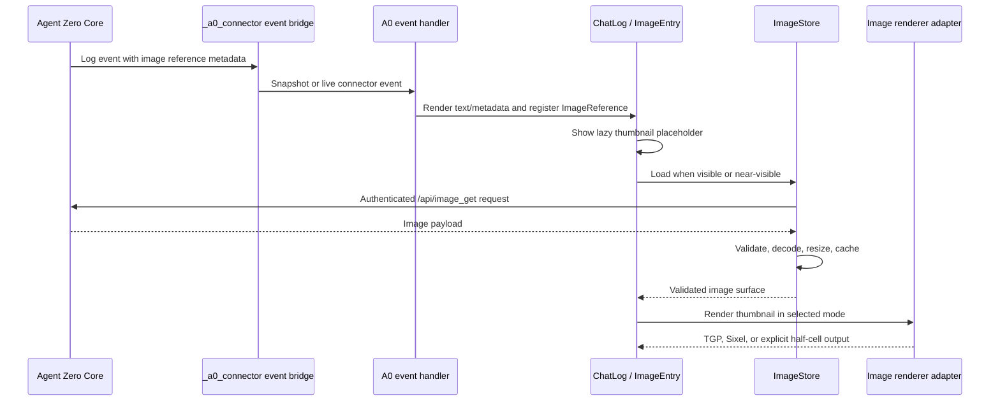

# Inline Images and Browser Screenshots in the A0 TUI

**Status:** Approved design

**Date:** 2026-08-10

**Repository:** `TerminallyLazy/a0-connector`

**Related external component:** Agent Zero Core builtin `plugins/_a0_connector`

## Summary

Add inline image rendering to the Textual chat transcript for:

- browser screenshots recorded by Agent Zero browser tools;
- user image attachments present in chat history; and
- assistant image attachments or image references present in chat history.

Images appear expanded near the transcript content that owns them. A browser screenshot appears inside the same browser tool entry, beneath its action metadata, matching the Agent Zero WebUI. A focused image collapses inline when clicked or when the user presses Enter or Space, and the same action expands it again.

The CLI uses a terminal-native raster protocol when available, preferring the Kitty graphics protocol (TGP) and then Sixel. Environments without a complete native path keep the pre-image transcript; half-cell Unicode rendering is explicit preview/debug behavior only. Image failures remain local to the image widget and never interrupt chat operation.

## Goals

1. Display browser screenshots in the TUI at the point where the corresponding browser action appears.
2. Display user and assistant images already represented in live events or replayed chat history.
3. Preserve the existing Python 3.10+ support contract.
4. Provide native raster output in capable terminals without changing ordinary transcripts elsewhere.
5. Show a useful expanded image immediately while allowing inline collapse without a modal or external application.
6. Load images safely through the existing authenticated Agent Zero session without widening the artifact trust model.
7. Keep headless and gateway modes byte-for-byte free of terminal graphics protocol output.

## Non-goals for v1

- Image previews in the message composer.
- A modal, lightbox, or external full-resolution viewer.
- Save-image or open-image commands.
- Automatic fetching of arbitrary cross-origin URLs.
- Animated image playback; animated formats show their first frame.
- SVG rendering.
- Persistent image caches or writing fetched images to disk.
- Native terminal graphics in `textual-serve`; the browser preview uses half-cell output.
- Changing browser screenshot consent, privacy, or sensitive-action gates.

## Current System and Verified Data Paths

The CLI receives chat history and live updates as connector events and renders them into `ChatLog`. Text, tool, status, and code entries are produced through `event_handlers.py`, `rendering.py`, and widgets under `src/agent_zero_cli/widgets/`.

Browser screenshot bytes do not need to be added to the connector event schema. Agent Zero Core already:

1. receives the base64 browser artifact from the CLI browser host;
2. materializes it through `chat_media.save_image_base64`;
3. records the resulting reference on the browser tool log as `Screenshot: img://<path>&t=...`; and
4. passes the log key/value metadata through `_a0_connector` to the CLI.

The WebUI displays the same metadata by recognizing `img://` values. The CLI can resolve these references through the authenticated Agent Zero `/api/image_get?path=...` endpoint using its existing `httpx.AsyncClient` session.

User attachment replay has one verified gap. The standard HTTP message path stores attachment names on the user log, while `_a0_connector`'s WebSocket send-message handler currently logs the user message with empty metadata. A narrowly scoped Agent Zero Core correction will record sanitized attachment filenames in the WebSocket-created user log, matching the HTTP path. It will not transmit image bytes through Socket.IO or change upload permissions.

## Design Decisions

### Renderer strategy

Use `textual-image` behind an A0-owned adapter. Dependency markers and repository lock files will select a Python 3.10/3.11-compatible release line and the current compatible release line for Python 3.12+. Application code will not import version-specific renderer classes outside the adapter.

The adapter exposes four effective modes:

- `tgp`
- `sixel`
- `halfcell`
- `off`

`auto` is the default selection policy rather than an effective renderer. It chooses TGP, then Sixel, then `off`.

This approach preserves Python 3.10+, uses established protocol implementations, and confines upstream compatibility differences to one module. Reimplementing TGP and Sixel inside A0 or raising the project's Python minimum is outside the approved design.

### Placement and interaction

- Browser screenshots are children of the existing browser tool/status entry and appear beneath its action metadata.
- User images appear beneath the corresponding user message.
- Assistant images appear beneath the corresponding assistant response.
- Multiple images are stacked vertically in source order.
- Each image is independently focusable.
- Images begin expanded.
- Click, Enter, or Space toggles thumbnail and expanded states.
- Images expand within the transcript; no modal or external viewer is opened.
- Expanded state survives updates to the owning event and terminal resizing.

### Sizing

Images preserve their complete aspect ratio and are never cropped.

- Thumbnail maximum: 36 columns by 12 terminal rows.
- Expanded maximum: available transcript width, capped at 96 columns by 32 rows.
- Narrow terminals reduce those dimensions automatically.
- Active renderers target the same terminal-cell dimensions so explicit mode changes do not materially change transcript layout.

## Architecture

### `media_refs.py`: reference extraction

Add a pure, side-effect-free media reference layer under `src/agent_zero_cli/`. It converts eligible connector event data into normalized `ImageReference` values without performing network or UI work.

An `ImageReference` carries enough information to:

- identify the owning event and stable transcript position;
- deduplicate the underlying image;
- classify it as browser, user, or assistant media;
- produce a safe caption and copy placeholder; and
- resolve either an authenticated Agent Zero path or bounded inline image data.

Eligible sources are:

1. `Screenshot` values beginning with `img://` in browser tool metadata;
2. the structured `browser_snapshot` reference when present;
3. sanitized user attachment filenames in event metadata;
4. Agent Zero-hosted assistant image references in metadata or Markdown; and
5. bounded `data:image/...` references.

Cache-busting query parameters on `img://` references are ignored when deriving the stable identity but retained as needed for the fetch request. Unknown schemes, filesystem paths, and arbitrary external URLs are not automatically fetched.

The extractor is idempotent. Receiving a later update for the same event and image produces the same stable key, enabling the UI to promote a placeholder rather than mount a duplicate.

### `image_store.py`: authenticated loading and memory cache

Add an asynchronous store responsible for loading, validating, deduplicating, and caching image payloads.

Agent Zero-hosted references are fetched through `A0Client` and its authenticated session via `/api/image_get`. The store does not create a second unauthenticated HTTP client. User attachment filenames are converted to their Agent Zero upload path only after basename sanitization.

The store enforces:

- a 25 MiB encoded payload ceiling, matching Agent Zero's artifact limit;
- recognized `image/*` content types;
- one bounded retry for transient network failures;
- at most four concurrent image fetch/load tasks;
- at most one full-resolution image decoder at a time;
- request coalescing when multiple widgets need the same image;
- cancellation when a context or host becomes obsolete; and
- a 64 MiB process-memory LRU cache.

Cache accounting includes retained encoded bytes and resized decoded surfaces. A
single decode permit bounds full-resolution memory pressure; each image is
downsampled before orientation and color conversion, and the full-resolution
decoder state is then released. Eviction releases any renderer-owned surfaces
and permits a later refetch if the image becomes visible again. No fetched image
is written to disk.

### `image_render.py`: capability and renderer adapter

Add a single A0-owned interface over `textual-image`. It is responsible for:

- selecting the effective image mode;
- insulating the rest of the application from conditional dependency versions;
- creating native or explicitly requested half-cell Textual widgets/renderables;
- resizing while preserving aspect ratio;
- debouncing resize-driven rerenders; and
- invoking protocol-specific cleanup when a widget is removed.

Capability probing occurs inside the TUI startup path in `__main__._run_app`, before Textual takes control of terminal input. The module is not imported by headless or gateway startup paths.

`A0_CLI_IMAGE_MODE` accepts `auto`, `tgp`, `sixel`, `halfcell`, or `off`. There is no persisted setting or slash command in v1.

Selection rules:

1. `auto` chooses TGP, then Sixel, then `off`.
2. Non-TTY sessions select `off`; automated tests retain a library-free renderer, while `textual-serve` explicitly forces half-cell.
3. An explicitly requested but unsupported native mode selects `off` and emits one concise notice.
4. An invalid value falls back safely and emits one concise notice.
5. `off` omits image entries and never fetches image bytes, preserving the pre-image transcript.

The implementation plan must begin with a compatibility proof covering Textual 8.2.8 and every supported Python dependency branch. If the Python 3.10-compatible `textual-image` line cannot operate correctly with the current Textual version, implementation pauses for a design revision. It must not silently raise the Python floor, vendor a renderer, or drop native-protocol support.

### `widgets/image_entry.py`: transcript image widget

Add a focusable composite widget with these states:

- pending/lazy;
- loading;
- rendered thumbnail;
- rendered expanded;
- unavailable; and
- disabled.

The widget owns presentation and interaction, not fetching policy. It displays its caption, focus treatment, and an Enter/Space expansion hint without overwhelming the surrounding transcript.

On click or activation, it toggles its size state and requests an appropriately sized rendered surface. If the source payload is already cached, expansion does not perform another network request.

Failures become stable placeholders such as:

```text
[Browser screenshot unavailable: unsupported format]
```

The widget exposes protocol cleanup so TGP or Sixel content does not remain painted over terminal cells later reused by the transcript.

### `ChatLog` and event integration

`event_handlers.py` will extract image references for both snapshot and live events before or alongside normal text rendering. Existing message and metadata output is mounted immediately; image loading never delays it.

`ChatLog` gains sequence-aware media bookkeeping in addition to its existing text/status bookkeeping. It must support an image becoming known after the initial tool event. For example, an active browser status can first render action metadata, then receive a later `Screenshot` value and gain an image child in place without duplicating the tool entry.

Media entries participate in:

- normal transcript ordering;
- visible-child and focus calculations;
- scroll-to-bottom and history paging behavior;
- `/clear` cleanup; and
- transcript copy operations.

Copying never includes raw bytes, base64, cookies, or cache paths. Images produce semantic placeholders, for example:

```text
[image: Browser screenshot — example.com]
[image: User attachment — scan.png]
```

### Agent Zero Core attachment metadata correction

In the external Agent Zero Core repository, update the builtin `_a0_connector` WebSocket send-message handler to attach sanitized uploaded filenames to the user log's key/value metadata, matching the existing HTTP message-send behavior.

This correction:

- changes only metadata used by live events and history replay;
- does not add a connector event type;
- does not put image bytes in Socket.IO frames;
- does not change upload authorization or path validation;
- does not modify browser screenshot handling; and
- must be tested and deployed/restarted independently of the CLI repository change.

## End-to-End Flow



If the image reference arrives after the text/tool event, the same flow begins at reference registration and updates the existing transcript entry.

## Lazy Loading and Transcript Behavior

Only visible and near-visible image entries are eligible to load. Replaying a long history must not eagerly fetch every attachment. A queue bounded to four active requests services eligible entries in transcript order.

The transcript invalidates in-flight loads more than two viewports away and
retains completed surfaces for eight viewports. This keeps several expanded
siblings mounted through normal focus and autoscroll movement while bounding
decoded surfaces in long histories. Visible Sixel surfaces redraw together
after viewport changes because Sixel pixels are not terminal-retained.

Normal ChatLog behavior remains authoritative:

- new live content follows existing autoscroll rules;
- expanding an image adjusts layout without forcibly jumping a user who is reading older content;
- history paging preserves existing entries and expansion state;
- resizing recomputes target dimensions with a debounce to reduce Sixel flicker; and
- changing context cancels obsolete work before rendering results into the new context.

## Image Validation and Security

Only authenticated same-origin Agent Zero image paths and bounded inline data are automatically loaded.

Validation rules:

- Accept PNG, JPEG, WebP, GIF, and BMP.
- Display only the first frame of animated images.
- Reject SVG with a labeled placeholder.
- Accept inline data only when its declared MIME type is a recognized `image/*` type and the decoded payload remains within 25 MiB.
- Use Pillow verification before rendering.
- Reject malformed images and decompression-bomb payloads.
- Enforce a 32-megapixel decoded dimension ceiling.
- Read image orientation metadata, compute orientation-aware target bounds, and
  downsample before applying orientation and color conversion.
- Composite alpha against the transcript background.
- Never log cookies, raw base64, fetched bytes, or decoded cache contents.
- Never include those values in transcript clipboard text.

Browser screenshots remain subject to the existing browser tool consent and privacy gates. Inline rendering consumes the artifact already approved and recorded by Agent Zero; it does not create a new capture path.

## Error Handling

Image-specific errors never fail a context snapshot, live event handler, chat send, or browser action.

- Transient network failure: retry once, then show an unavailable placeholder.
- Authentication failure: show an unavailable placeholder and rely on the existing connection/session flow; do not loop.
- Unsupported or corrupt payload: show the reason in a concise placeholder.
- Renderer failure: clean up partial native output and show an unavailable placeholder without a pixelated fallback.
- Cleanup failure: suppress it after clearing the widget's bookkeeping so chat teardown can continue.
- History reload: may attempt an unavailable image again, but no background retry loop persists.

## Lifecycle and Cleanup

- Image cache contents live only for the current process.
- Context or host changes cancel obsolete requests.
- Disconnect and application exit clear the cache.
- Widget removal invokes native renderer cleanup.
- `/clear` removes image widgets and their protocol resources.
- Headless and gateway modes never initialize the renderer or emit terminal image sequences.

## Testing Strategy

### Pure and service-level tests

Cover:

- extraction from `Screenshot`, `browser_snapshot`, attachment metadata, assistant Markdown, and inline data;
- stable identity with cache-busting parameters;
- basename/path sanitization and external URL rejection;
- capability selection for automatic, explicit, invalid, non-TTY, test, and `textual-serve` cases;
- authenticated URL construction and reuse of the existing client session;
- MIME, byte-size, pixel-count, format, orientation, alpha, animation-first-frame, and corruption handling;
- request deduplication, four-task fetch/load concurrency, single-decoder
  concurrency, one retry, cancellation, and LRU eviction; and
- complete aspect-ratio-preserving target size calculations.

### Textual and widget tests

Use a fake image renderer so snapshots remain deterministic and never contain native terminal control sequences. Cover:

- browser screenshots appearing beneath metadata in the same tool entry;
- late screenshot metadata promoting the existing entry without duplication;
- user and assistant attachment placement;
- multiple vertically stacked images;
- default expanded state;
- click, Enter, and Space toggling;
- expansion state surviving event updates and resize;
- lazy visible/near-visible loading;
- normal autoscroll and history paging;
- semantic copy placeholders;
- context-switch cancellation; and
- `/clear`, widget removal, disconnect, and exit cleanup.

### Agent Zero Core tests

Cover the external `_a0_connector` correction independently:

- WebSocket message send with attachments records sanitized attachment filenames in user log metadata.
- History replay returns those filenames.
- Image bytes and authentication material are absent from the event.
- Sending without attachments remains unchanged.
- Invalid attachment references retain existing rejection behavior.

### Integration and manual acceptance

Verify these paths end to end:

1. Browser action to screenshot artifact to connector event to inline thumbnail.
2. User image upload followed by reconnect and history replay.
3. Assistant Agent Zero-hosted image in live and replayed history.
4. TGP-capable terminal in automatic and forced modes.
5. Sixel-capable terminal in automatic and forced modes.
6. Unsupported Bash, Zsh, and PowerShell terminal sessions remain image-free.
7. `tmux`, including safe disabling when native pass-through is unavailable.
8. `textual-serve` forced half-cell output and static snapshot capture.
9. No visual ghosts after scrolling, expanding, collapsing, resizing, clearing, switching context, or exiting.
10. Headless and gateway outputs unchanged.

A performance fixture containing at least 100 transcript events and 50 image
references must demonstrate that images are not eagerly fetched, no more than
four fetch/load tasks and one full-resolution decoder run concurrently, the
cache respects its 64 MiB ceiling, and scrolling remains stable.

## Documentation and Ownership Updates During Implementation

Implementation will update the owning documentation as behavior lands:

- root `README.md` for user-visible support and the environment override;
- `docs/tui-frontend.md` for rendering, interaction, preview limitations, and QA;
- `docs/architecture.md` for media reference and authenticated fetch flows;
- `devtools/README.md` for forced half-cell browser-preview behavior;
- `src/agent_zero_cli/AGENTS.md` and `src/agent_zero_cli/widgets/AGENTS.md` for new module ownership;
- `tests/AGENTS.md` if fixtures or test boundaries change; and
- dependency inputs and locks under their owning DOX scopes.

The Agent Zero Core correction must be documented and tested in the Core repository under its own contribution rules. It is not vendored into `a0-connector`.

## Rollout and Evidence Surfaces

Rollout proceeds behind the existing TUI boundary; no connector protocol version bump is required for browser screenshots.

Evidence is reported as three independent surfaces:

1. **Implementation evidence:** dependency compatibility proof, automated CLI/Core tests, and deterministic half-cell snapshots.
2. **Runtime evidence:** the corrected builtin Core plugin is installed in the intended Agent Zero runtime and that runtime has been restarted or reloaded.
3. **Terminal acceptance:** browser screenshots and history attachments have been visually accepted in real TGP, Sixel, and half-cell sessions.

Passing automated tests does not imply the Core runtime is updated, and updating the runtime does not imply native terminal rendering has been visually accepted.

## Acceptance Criteria

The feature is complete when all of the following are true:

- A browser screenshot displays beneath the metadata of its existing browser tool entry.
- User and assistant images represented in live or replayed history display beneath their owning messages.
- Images begin as complete, uncropped expanded views and collapse/expand inline by click, Enter, or Space.
- TGP and Sixel render full raster images where supported; half-cell output remains explicit only.
- An unavailable image produces a stable placeholder without interrupting chat.
- Long history replay loads only visible or near-visible images and remains within concurrency and cache limits.
- Transcript copying yields semantic image placeholders and no binary or secret material.
- Context changes, `/clear`, disconnect, and exit leave no stale requests or native terminal graphics.
- Python 3.10+ remains supported.
- Headless and gateway behavior is unchanged.
- The Agent Zero Core attachment metadata correction passes its own tests and has separate live-runtime evidence.
